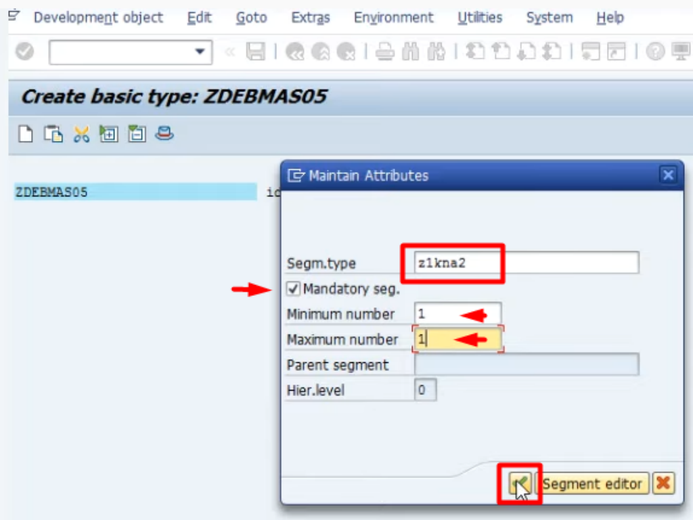
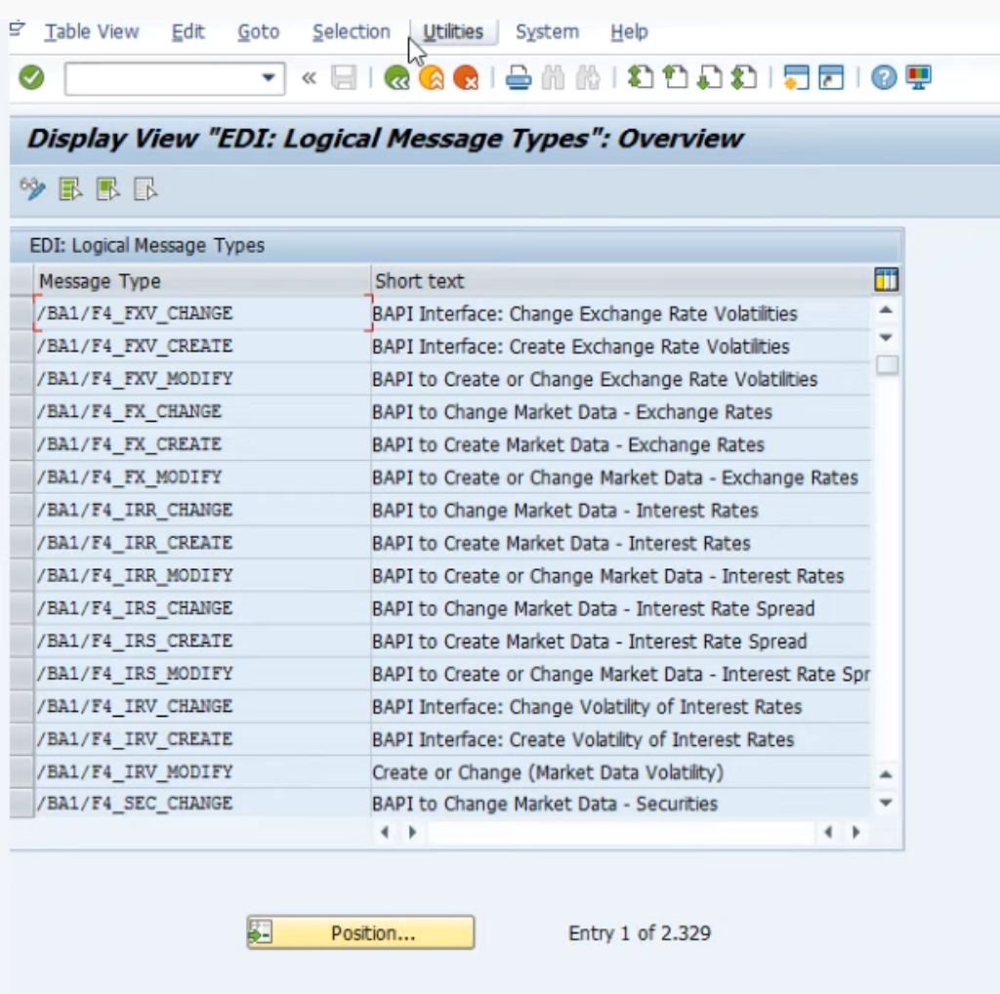

ALE - Application Link Enabling
===

[SAP ABAP - ALE](https://www.youtube.com/watch?v=msHxBYqBx88&list=PLWPirh4EWFpH4i1J7CxvDabSycl5YbAhG&index=64)

- ALE (Application Link Enabling) это технология для коммуникации между удаленным серверами для обмена данными  по выделенному сетевому соединению.
- в ALE Application значит Customer Master Application, Material Master Application, Sales Order Application.
- в ALE Link значит сетевое соединение, Enabling значит разрешение на соединение

## Type of data transfer

- Outbound
- Inbound
- Between SAP to SAP
- - между сап системами выполняется при помощи IDOC - Intermediate Document
- Between SAP to Non-SAP
- - EDI (Electronic Data Interchange)
- - САП для EDI использует прослойку TIBCO or XI
- - IDOC конвертируется в XML и отдается в TIBCO or XI

## IDOC

[SAP ABAP - IDOC](https://www.youtube.com/watch?v=jNeEV7VJulk&list=PLWPirh4EWFpH4i1J7CxvDabSycl5YbAhG&index=65)

- IDOC - Intermediate Document содержащий данные
- технически IDOC это группа сегментов
- каждый сегмент это группа полей (как структура)
- все стандартные SAP сегменты начинаются с буквы `E1`
- все пользовательские сегменты начинаются с буквы `Z1`

### Пример IDOCs

- DEBMAS: 01, 02, 03, 04, 05 - пример IDOC дебитора
- CREMAS: 01, 02, 03 ... - пример IDOC кредитора
- MATMAS: 01, 02, 03... - пример IDOC материала
- - где 05 - это последняя версия

## Create an IDOC

### WE31 - Step1: создадим нужные сегменты с нужными полями

- задать тип сегмента, например Z1KNA2, нажать кнопку создать
- 
- задать краткое описание
- задать список полей
- 
- сохранить и вернуться назад
- в меню Edit->Set release
- 
- объявление сегмента и его релиз (номер релиза будет показан) закончен и сегмент может быть использован для передачи данных
- 
- аналогично создадим еще один сегмент типа Z1KNBK2 с нужными полями и release
- 
- 
- 

### WE30 - Step2: создадим IDOC

- WE30 - задать имя IDOC, например: ZDEBMAS05, нажать создать
- 
- задать описание и нажать Enter
- 
- 
- выделить имя idoc и нажать на кнопку "Create segment (Shit+F6)"
- 
- in popup:
- - задать имя ранее созданного типа сегмента (segment type) - Z1KNA2
- - задать minimum and maximum = 1, так как дебитор имеет одну основную запись
- - отметить чек бокс "Mandatory seg", если хотим сделать сегмент обязательным
- - нажать enter
- - 
- теперь навести курсор на Z1KNA2 сегмент в IDOC, выделив его, и нажать на кнопку создать
- 
- появится popup
- - выбрать первый радио переключатель (добавить как дочерний) и нажать ввод
- - 
- - задать тип сегмента Z1KNBK2
- - задать minimum =1 and maximum = 99999 т.к. каждый дебитор будет иметь более чем один счет
- 
- - нажать ввод и будет показана иерархия созданного IDOC - имя типа idoc и его сегменты
- сохранить созданный IDOC
- 

### Привязка сообщений к созданному IDOC

- WE81 - добавление нового типа сообщения
- - 
- - Edit -> New entry, задать message type and shot text for it and save it
- - 
- WE82 привязка нового типа сообщения к IDOC
- 
- 

- задать
- - message type - тип(имя) созданного сообщения на предыдущем шаге
- - basic type - имя IDOC
- - номер релиз IDOC - в WE31 можно посмотреть 
- - 
- - вернуться назад

