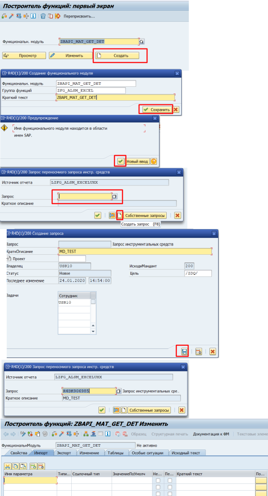

BAPI - Business Application Programming Interface
===================================

[Home](../Index.md)

[SAP ABAP - BAPI](https://www.youtube.com/watch?v=ESfQ2G6p6qQ&list=PLWPirh4EWFpH4i1J7CxvDabSycl5YbAhG&index=45)

BAPI это удаленно доступный функциональный модуль (FM) обернутый в бизнес объект (BO), который предоставляет API для коммуникации между SAP-SAP и SAP-No SAP серверами. В основе BAPI используется RFC технология. На шаге инициализации это RFC (FM открытый для удаленного вызова) модуль, который потом вставляется в бизнес объект. BAPI определяются в BOR (Business object repository) как методы SAP бизнес объекта, выполняющие специфичные бизнес функции.

## Business Object Repository (BOR)

Это репозиторий с типами SAP business объектов и их BAPIs.

### Business Objects

Это объект аналогичный **классу**, который объединяет атрибуты, методы, интерфейсы, ключевые поля, события для соответствующего бизнес сценария или бизнес приложения.

#### SWO1 - Business Object Repository

## BAPI usage

- Генерация отчетов
- Коммуникация между SAP и No SAP
- Загрузка данных в таблицы САП.

### Rules for BAPI usage

- BAPI имя должно начинаться с BAPI или ZBAPI
- Все входящие и исходящие параметры должны быть типа структура, а элементарные типы для параметров не допустимы
- Имена всех структур должны начинаться с BAPI или ZBAPI
- Все параметры должны передаваться по значению, передача по ссылке не поддерживается.
- Все BAPI должны иметь возвращаемый параметр с именем `RETURN` и типом LIKE `BAPIRET2` для показа сообщения об ошибке.
- Если BAPI отработало успешно, то далее, для сохранения данных в таблицы DB, требуется использовать BAPI `BAPI_TRANSACTION_COMMIT`
- Если BAPI отработало с ошибкой, то далее требуется использовать BAPI `BAPI_TRANSACTION_ROLLBACK`

## BAPI TYPES

### Standard BAPI

Некоторые BAPI (standardized bapis) предоставляют базисную функциональность с могут быть использованы для многих SAP Business Objects.

#### BAPIs reading data

- GetList()
- GetDetail()
- GetStatus()
- ExistenceCheck()

#### BAPIs creating or changing data

- Create()
- Change()
- Delete()
- Undelete()

#### BAPIs Mass Processing

- ChangeMultiple()
- CreateMultiple()
- DeleteMultiple()

### Custom BAPI

[Custom BAPI](https://www.youtube.com/watch?v=dfEfYfg3GR4&list=PLWPirh4EWFpH4i1J7CxvDabSycl5YbAhG&index=48)

Шаги и пример последовательность при создании BAPI.

- создать в SE11 входящую и исходящую структуры как параметры для BAPI
- создать в SE37 FM и сделать его доступным удалено
- создать в SWO1 бизнес объект и добавить в него FM, сделать встраивание и деблокирование для BO.

#### Create Import/Export Structure

##### SE11 создать входящую/Import структуру ZBAPI_MATNR:

После создания активировать структуру.

##### SE11 создать исходящую/Export структуру ZBAPI_MARA:

После создания активировать структуру.

##### Активировать созданные структуры

#### Creating Function Module

##### SE37 создать FM и сделать его доступным удаленно.

SE37 - задать название FM, Группу функций и Краткий текст, задать запрос на перенос инструментальных средств или создать его здесь же.

###### Определить входной параметр с передачей по значению

###### Определить выходной и возвращаемый параметр с передачей по значению

Возвращаемый параметр с именем `RETURN` и типом  `BAPIRET2`

###### Записать код, сохранить, активировать

###### Сделать FM доступным удаленно

###### Сохранить, активировать и протестировать FM

#### SWO1 - Create a type of BO и Insert RFC into BO

### BAPI - транзакция 

Изучить как пользоваться, какие bapi можно использовать и как создавать на основе bapi web сервисы.

