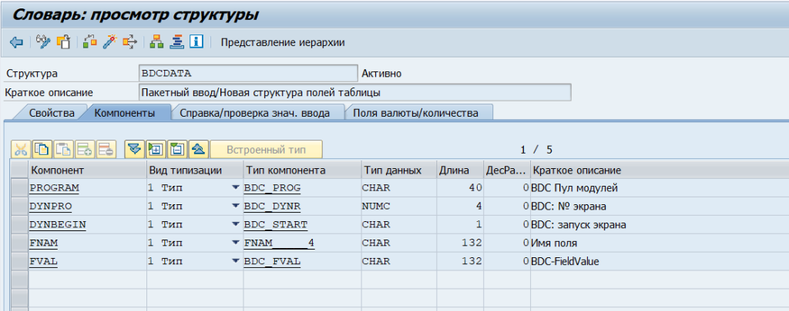
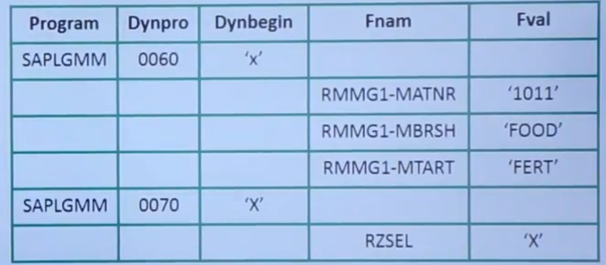
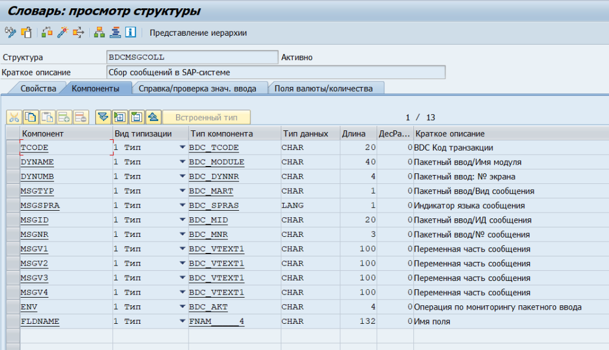
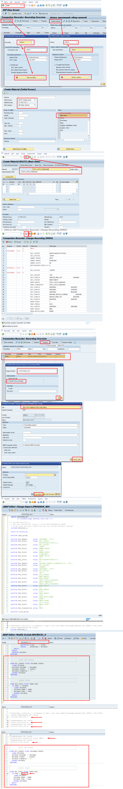
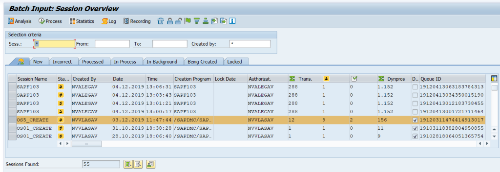
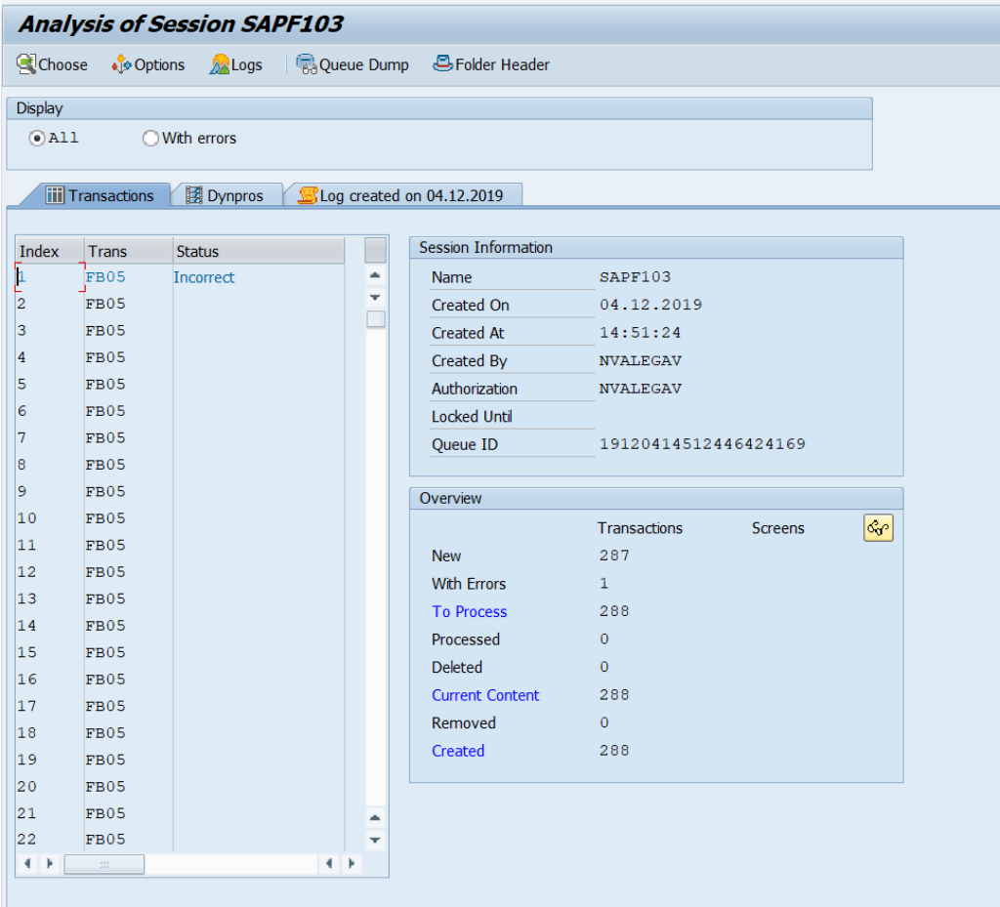

Batch Data Communication
===================

[Home](../Index.md)

[Batch Data Communication](https://www.youtube.com/watch?v=eiEcW849vKY&list=PLWPirh4EWFpH4i1J7CxvDabSycl5YbAhG&index=49)

Batch Data Communication (BDC) это техника для массовой загрузки данных в САП.

- OUTBOUND PROCESS - передача данных из САП во внешние системы
- INBOUND PROCESS - передача данных из внешних систем в САП


## BDC methods

- Call transaction method
- - Synchronous/Asynchronous
- - для передачи небольшого количества записей < 10 000
- - работает быстрее чем Session method
- - ошибки нужно обрабатывать явно входе выполнения
- - данные обновляются немедленно
- - это Screen Level Processing, поэтому все ошибки будут как при ручном вводе
- Session method
- - только Synchronous
- - для передачи большого количества записей > 10 000 до 1 млн.
- - работает медленнее чем Call transaction метод
- - ошибки записываются в Log, который можно посмотреть через SM35
- - данные не обновляются пока сессия исполняется
- - это Screen Level Processing, поэтому все ошибки будут как при ручном вводе


## Call transaction (Screen Level Processing)

Загрузка данных в САП из простого текстового файла путем вызова транзакции и прохождения по ее экранам. Это Screen Level Processing, поэтому для данных выполняются все проверки как и при ручном вводе  и показываются все сообщения об ошибках и информационные.

- Используется для небольшого объема данных (<10 000 строк).
- Синхронное и асинхронное обновление данных.
- Данные немедленно появляются в DB
- Нужно обрабатывать ошибки и сообщения, для этого объявляется внутренняя таблица типа `BDCMSGCOLL`.


### Syntax of CALL TRANSACTION `TCODE`


```
*Это выполняется в цикле для каждой записи из файла: Loop at I_FILE INTO WA_FILE
CALL TRANSACTION <TCODE>
    USING  <DBCDATA>     "вн таблица LIKE BDCDATA с инфо по транзакции (экраны, поля, значения)
    UPDATE <A/S>         "A = asynchronous; S = synchronous
    MODE   <A/E/N>       "A = foreground all screen; E = only error screen; N = Background
    MESSAGES INTO <Message Internal Table>. "вн таблица TYPE BDCMSGCOLL для сообщений от транзакции

IF SY-SUBRC = 0.
    PERFORM DISPLAY_SUCCESS_REC. "сабрутина для успешной записи
ELSE
    PERFORM DISPLAY_ERROR_REC. "сабрутина для ошибки записи
ENDIF.

...

*сабрутина для успешной записи
FORM DISPLAY_SUCCESS_REC.
    READ TABLE MESSTAB
        WITH KEY MSGTYP = 'S'.
        ...
ENDFORM.

*сабрутина для ошибки записи
FORM DISPLAY_ERROR_REC.
    LOOP AT MESSTAB WHERE MSGTYP = 'E'.
        CALL FUNCTION 'FORMAT_MASSAGE'.
        ...
    ENDLOOP.    
ENDFORM.
```

#### USING `DBCDATA`

`BDCDATA` внутривенная таблица на основе одноименной структуры BDCDATA  из словаря, в которую помещаются данные по одной итерации транзакции - экраны, поля экранов и значения полей экранов. Из данной BDCDATA вн. таблицы FM CALL TRANSACTION выполнит одну итерацию обработки заданных в ней экранов, полей и вернет сообщения.



`<DBCDATA>` параметр - это внутренняя таблица одноименной структуры `BDCDATA` из словаря, предназначенная для хранения информации по каждому полю экрана соответствующей транзакции со следующими полями:

- Program - имя программы экрана
- Dynpro - номер экрана
- Dynbegin - начало процесса
- Fnam - имя поля на САП экране
- Fval - значение для поля САП экрана




#### UPDATE `A/S`

Задает метод обновления/записи данных

##### A - asynchronous update (COMMIT)

При таком типе обновления код не ждет завершения записи данных текущей строки, а сразу переходит к обработке следующей строки.

##### S - synchronous update (COMMIT & WAIT)

При таком типе обновления код/процесс ждет завершения записи данных текущей строки и только после его завершения переходит к обработке следующей строки

#### MODE `A/E/N`

Задает режим показа экранов

##### A -all screen

A = foreground all screen - выполняется показ всех экранов транзакции

##### E - only error screen

E = only error screen - выполняется показ только экранов ошибок

##### N - Background 

N = Background - ни какие экраны не показываются, вся работа выполняется в фоне.


#### MESSAGES INTO <Message Internal Table>

Для вызываемой транзакции нужно обрабатывать сообщения, поэтому в этом параметре выполняется запись во  внутреннюю таблицу (<Message Internal Table> - например MESSTAB) типа `BDCMSGCOLL`, в которую будут записаны все сообщения.

##### Структура `BDCMSGCOLL`




### BDC Recording Method

[BDC Recording Method](https://www.youtube.com/watch?v=nvfRB7q3BK8&list=PLWPirh4EWFpH4i1J7CxvDabSycl5YbAhG&index=52)

Ввиду того, что трудно найти всю техническую информацию по транзакции (экраны, поля), то используют для этих целей метод записи транзакции, при котором САП записывает все поля в транзакции и генерирует техническую информацию - имя программы, номер экрана, имя поля, значение поля для каждого поля на экране САП. Это позволяет легко создавать BDC программы на основе полученной информации при записи транзакции. На основе записи транзакции можно генерировать ABAP код по заполнению BDCDATA внутренней таблицы для каждой итерации вызова FM CALL TRANSACTION. 

#### SHDB - запись транзакции и создание BDC программы

- вызвать транзакцию SHDB
- кликнуть на "Создать новую запись"
- дать новое имя новой записи, например ZMM41
- задать код транзакции для данной записи
- нажать на кнопку "Начать запись"
- выполняем записываемую транзакцию, заполняем нужные поля, жмем сохранить
- жмем кнопку назад и попадаем обратно в SHDB
- выбираем нашу, только что сделанную, запись и жмем на кнопку "Создать программу", задаем имя нашей программы  например ZPROGRAM_BDC
- Выбираем кнопку "transfer from recording" - создать из записи (ZMM41), жмем Enter
- задаем заголовок для нашей программы и жмем кнопку "Source Code", выбираем пакет для программы
- созданная программа откроется в редакторе ABAP  и будет содержать всю необходимую нам информацию по выполнению данной транзакции - экраны и их поля.
- модифицируем программу для чтения данных из файла:
- - переходим в include bdcrecx1_s, идем вниз кода include программы и копируем от туда две сабрутины: `bdc_dynpro` и `bdc_field` в нашу программу в низ кода, а стоку  include bdcrecx1_s за комментируем.
- - заменяем nodata в сабрутине `bdc_field` на space
- - комментируем строки: `include bdcrecx1; start-of-selection; perform open_group; perform close_group; perform bdc_transaction using MM41`
- - создаем внутреннею таблицу по структуре равную текстовому файлу с данными с типами = полям вставки
- - создаем вн таблицу `BDCDATA LIKE BDCDATA OCCURS 0 WITH HEADER LINE.` для хранения в ней данных одной итерации транзакции - экраны, поля, значения.
- - создаем вн таблицу `MESSTAB LIKE BDCMSGCOLL JCCURS 0 WITH HEADER LINE.` для хранения сообщений от выполнения одной итерации транзакции.
- - загружаем во вн таблицу `I_FILE` данные из текстового файла используя модуль `GUI_UPLOAD`
- - Loop at I_FILE INTO WA_FILE - проходим циклом по каждой строке данных из файла и делаем для каждой строки внутри цикла заполнение вн таблицы BDCDATA, вызов и исполнение транзакции для данной строки, запись сообщений от выполнения транзакции во вн таблицу MESSTAB. Очистка внутренних таблиц и структур используемых в цикле перед следующей итерацией.





#### Пример BDC программы с Call transaction

```
report ZPROGRAM_BDC
       no standard page heading line-size 255.

* Include bdcrecx1_s:
* The call transaction using is called WITH AUTHORITY-CHECK!
* If you have own auth.-checks you can use include bdcrecx1 instead.


*Переходим в bdcrecx1_s и копируем от туда в низ кода нашей программы функции
*BDC_DYNPRO и BDC_FIELD, которые нужны для заполнения BDCDATA вн таблицы
*затем комментируем эту строку
*include bdcrecx1_s.

*комментируем эту строку
*start-of-selection.

*комментируем эту строку
*perform open_group.

*тип - структура равная по структуре файлу загрузки
TYPES: BEGIN OF TY_FILE,
  MAKTX TYPE MAKT-MAKTX,         " краткий текст
  ZZMAKTX99 TYPE MAKT-ZZMAKTX99, " текст 99 символов
END OF TY_FILE.
*переменная - внутренняя таблица для хранения данных из файла
DATA I_FILE TYPE TABLE OF TY_FILE.
*переменная - структура для хранения одной строки данных из файла
DATA WA_FILE TYPE TY_FILE.

*переменная - строка для хранения сообщений
DATA LV_MSG TYPE STRING.


*BDC DATA DECLARATION
*переменная - внутренняя таблица для хранения данных одной итерации транзакции (экраны, поля, значения)
DATA BDCDATA LIKE BDCDATA     OCCURS 0 WITH HEADER LINE.

*переменная - внутренняя таблица для хранения сообщений от выполнения одной итерации транзакции
DATA MESSTAB LIKE BDCMSGCOLL  OCCURS 0 WITH HEADER LINE.

*загрузка данных из файла в вн таблицу
CALL FUNCTION 'GUI_UPLOAD'
  EXPORTING
    FILENAME                      = 'c:\TMP\MM42.txt'
   FILETYPE                      = 'DAT'
   HAS_FIELD_SEPARATOR           = ' '
*   HEADER_LENGTH                 = 0
*   READ_BY_LINE                  = 'X'
*   DAT_MODE                      = ' '
*   CODEPAGE                      = ' '
*   IGNORE_CERR                   = ABAP_TRUE
*   REPLACEMENT                   = '#'
*   CHECK_BOM                     = ' '
*   VIRUS_SCAN_PROFILE            =
*   NO_AUTH_CHECK                 = ' '
* IMPORTING
*   FILELENGTH                    =
*   HEADER                        =
  TABLES
    DATA_TAB                      = I_FILE "вн таблица куда будут помещены прочитанные данные
* CHANGING
*   ISSCANPERFORMED               = ' '
* EXCEPTIONS
*   FILE_OPEN_ERROR               = 1
*   FILE_READ_ERROR               = 2
*   NO_BATCH                      = 3
*   GUI_REFUSE_FILETRANSFER       = 4
*   INVALID_TYPE                  = 5
*   NO_AUTHORITY                  = 6
*   UNKNOWN_ERROR                 = 7
*   BAD_DATA_FORMAT               = 8
*   HEADER_NOT_ALLOWED            = 9
*   SEPARATOR_NOT_ALLOWED         = 10
*   HEADER_TOO_LONG               = 11
*   UNKNOWN_DP_ERROR              = 12
*   ACCESS_DENIED                 = 13
*   DP_OUT_OF_MEMORY              = 14
*   DISK_FULL                     = 15
*   DP_TIMEOUT                    = 16
*   OTHERS                        = 17
          .
IF SY-SUBRC <> 0.
* Implement suitable error handling here
  MESSAGE 'ОШИБКА ЧТЕНИЯ ФАЙЛА' TYPE 'E'.
ENDIF.


*выполнение транзакции в цикле для каждой строки данных из файла
LOOP AT I_FILE INTO WA_FILE.

  WRITE: / WA_FILE-MAKTX, WA_FILE-ZZMAKTX99.
*  BREAK-POINT.

*запускать программу нужно в том же языке системы в котором была запись
*т.к. это сказывается на некоторых значениях, лучше все делать в EN

*ниже блок кода по обработке экранов и их полей из записи транзакции:
*этот блок заполняет данными вн таблицу BDCDATA для каждой итерации
  perform bdc_dynpro      using 'SAPLMGMW' '0100'.

  perform bdc_field       using 'BDC_CURSOR'
                                'MSICHTAUSW-DYTXT(01)'.

  perform bdc_field       using 'BDC_OKCODE'
                                '=ENTR'.

  perform bdc_field       using 'RMMW1-MTART'
                                'ZSTD'.
  perform bdc_field       using 'RMMW1-MATKL'
                                'F1DKE1AAJ'.
  perform bdc_field       using 'RMMW1-ATTYP'
                                '00'.


  perform bdc_field       using 'MSICHTAUSW-KZSEL(01)'
                                'X'.

  perform bdc_field       using 'BDC_OKCODE'
                                '=ENTR'.

  perform bdc_dynpro      using 'SAPLWRF_GENERIC_HIERARCHY_F4' '0200'.
  perform bdc_field       using 'BDC_OKCODE'
                                '=ENTER'.
  perform bdc_field       using 'BDC_OKCODE'
                                '=ENTER'.

  perform bdc_dynpro      using 'SAPLMGMW' '3008'.
  perform bdc_field       using 'BDC_OKCODE'
                                '=BU'.
  perform bdc_field       using 'BDC_CURSOR'
                                'MAKT-MAKTX'.

  perform bdc_field       using 'MAKT-MAKTX' WA_FILE-MAKTX. "подставляем значение из структуры с данными из файла
  perform bdc_field       using 'MAKT-ZZMAKTX99' WA_FILE-ZZMAKTX99. "подставляем значение из структуры с данными из файла

*  BREAK-POINT.

  perform bdc_field       using 'MARA-TAKLV'
                                '1'.
  perform bdc_field       using 'MAW1-WBKLA'
                                '4110'.
  perform bdc_field       using 'MAW1-WLADG'
                                '0001'.
  perform bdc_field       using 'MARA-MTPOS_MARA'
                                'NORM'.
  perform bdc_field       using 'MARA-DATAB'
                                '29.01.2020'.
  perform bdc_field       using 'MARA-IPRKZ'
                                'D'.

*  комментируем эту строку
*  perform bdc_transaction using 'MM41'.

*  комментируем эту строку
*  perform close_group.

*имея заполненную вн таблицу BDCDATA вызываем транзакцию для каждой итерации
  CALL TRANSACTION 'MM41'
    USING BDCDATA "внутренняя таблица данных для одной итерации транзакции (экраны, поля, значения)
    UPDATE 'A'
    MODE 'A'
    MESSAGES INTO MESSTAB. "внутренняя таблица для хранения сообщений от выполнения одной итерации транзакции

*очистка переменных от данных для следующей итерации
  CLEAR WA_FILE.
  REFRESH  BDCDATA.
  CLEAR BDCDATA.
  REFRESH MESSTAB.
  CLEAR MESSTAB.

ENDLOOP.


*сабрутины для заполнения вн таблицы BDCDATA
*----------------------------------------------------------------------*
*        Start new screen                                              *
*----------------------------------------------------------------------*
FORM BDC_DYNPRO USING PROGRAM DYNPRO.
  CLEAR BDCDATA.
  BDCDATA-PROGRAM  = PROGRAM.
  BDCDATA-DYNPRO   = DYNPRO.
  BDCDATA-DYNBEGIN = 'X'.
  APPEND BDCDATA.
ENDFORM.

*----------------------------------------------------------------------*
*        Insert field                                                  *
*----------------------------------------------------------------------*
FORM BDC_FIELD USING FNAM FVAL.
  IF FVAL <> space.
    CLEAR BDCDATA.
    BDCDATA-FNAM = FNAM.
    BDCDATA-FVAL = FVAL.
    APPEND BDCDATA.
  ENDIF.
ENDFORM.
```


## Session method (Screen Level Processing)

[BDC Session Method](https://www.youtube.com/watch?v=vl79hyPgWtk&list=PLWPirh4EWFpH4i1J7CxvDabSycl5YbAhG&index=53)

Используют для загрузки большого количества данных > 10 000

Шаги процесса:

-  Create a session
-  Process a session

### FM для работы с Session

Для создании, закрытии сессии и вставки данных используются следующие FM:

#### BDC_OPEN_GROUP FM

FM BDC_OPEN_GROUP ( Open batch input session for adding transactions) Используется для создания сессии, имеет параметры:

```
CALL FUNCTION 'BDC_OPEN_GROUP'
 EXPORTING
   CLIENT                    = SY-MANDT
*   DEST                      = FILLER8
   GROUP                     = FILLER12 "Session name
   HOLDDATE                  = FILLER8 " сессия заблокирована до этой даты
   KEEP                      = FILLER1 "X - держать сессию для дальнейшего использования
   USER                      = FILLER12 "user name
*   RECORD                    = FILLER1
*   PROG                      = SY-CPROG
*   DCPFM                     = '%'
*   DATFM                     = '%'
* IMPORTING
*   QID                       =
* EXCEPTIONS
*   CLIENT_INVALID            = 1
*   DESTINATION_INVALID       = 2
*   GROUP_INVALID             = 3
*   GROUP_IS_LOCKED           = 4
*   HOLDDATE_INVALID          = 5
*   INTERNAL_ERROR            = 6
*   QUEUE_ERROR               = 7
*   RUNNING                   = 8
*   SYSTEM_LOCK_ERROR         = 9
*   USER_INVALID              = 10
*   OTHERS                    = 11
          .
```

#### BDC_INSERT FM

`BDC_INSERT` FM используется для передачи данных из вн таблицы `BDCDATA` (данные для одной итерации транзакции - экраны, поля, значения) в сессию, т.е. осуществляет выполнение заданной транзакции в режиме сессии.


```
CALL FUNCTION 'BDC_INSERT'
* EXPORTING
*   TCODE                  = FILLER4
*   POST_LOCAL             = NOVBLOCAL
*   PRINTING               = NOPRINT
*   SIMUBATCH              = ' '
*   CTUPARAMS              = ' '
  TABLES
    DYNPROTAB              =
* EXCEPTIONS
*   INTERNAL_ERROR         = 1
*   NOT_OPEN               = 2
*   QUEUE_ERROR            = 3
*   TCODE_INVALID          = 4
*   PRINTING_INVALID       = 5
*   POSTING_INVALID        = 6
*   OTHERS                 = 7
          .
```


#### BDC_CLOSE_GROUP FM

BDC_CLOSE_GROUP FM используется для закрытия сессии, открытой ранее через BDC_OPEN_GROUP FM

```
CALL FUNCTION 'BDC_CLOSE_GROUP'
* EXCEPTIONS
*   NOT_OPEN          = 1
*   QUEUE_ERROR       = 2
*   OTHERS            = 3
          .
```


### Processing and Status of Session

[Processing & Status of Session](https://www.youtube.com/watch?v=SFfy6l1YnYw&list=PLWPirh4EWFpH4i1J7CxvDabSycl5YbAhG&index=54)

#### SM35

Транзакция SM35 используется для обработки управления сессий. Каждая сессия хранит сценарий загрузки данных и если сессию запустить, то начнется выполняться загрузка данных для записанной в сессии транзакции. При запуске сессии можно выбрать foreground или background режимы выполнения. После выполнения сессии по кнопке Analysis и затем на вкладке Log можно посмотреть статусы и результаты обработки записей - ошибка или успех.








## Direct input method (Standard SAP Programs)

- Имеется стандартные САП программы для обновления и загрузки данных в САП из текстового файла. 
- Прямой метод используется для прямой загрузки в САП большого количества данных.
- В прямом методе вызывается несколько FM для прямой загрузки данных в базу САП
- Эти FM выполняют соответствующую проверку данных и вызывают ошибки при загрузке данных. Эти ошибки можно обработать и перезапустить механизм.
- Прямая загрузка выполняется в background режиме
- Прямой метод используется для real ime передачи данных т.к.:
- - структура файла с данными должна равняется структуре стандартной внутренней таблицы объявленной в стандартной программе
- - так же при такой загрузке не возможно получить все ошибки, т.к. программы работают через openSQL, в отличии от Call transaction и Session методов, которые работают на уровне экранов и поэтому выдают все ошибки как при ручном вводе.


## LSMW (Tool)

- используют для небольшого количества данных < 5000
- имеет  метода работы:
- - Прямой ввод
- - Метод записи - BDC
- - BAPI метод
- - ALE/IDOC метод