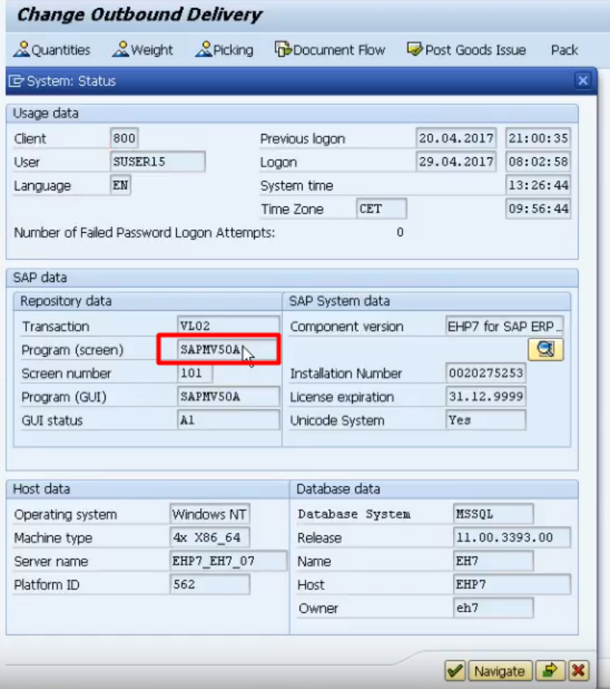

Enhancements
============

[Home](../Index.md)

[Enhancements](https://www.youtube.com/watch?v=e42Kd9GZZMg&list=PLWPirh4EWFpH4i1J7CxvDabSycl5YbAhG&index=56)


Enhancements - это концепция по кастомизации стандартной функциональности САП без изменения оригинального кода, а путем его расширения. Для этих целей используется Enhancement Framework. Enhancement точки называются Exit Point.

## Types of Enhancements

### User Exits

В основном коде имеются функции (сабрутины) где мы можем написать наш кастомный код для расширения приложения. Для использования User Exits требуется САП ключ для модификации стандартных приложений САП. User Exits доступны только в SD модуле.

Каждый User Exit начинается с userexit_xxxx.

```
Perform userexit_xxxx.
Form userexit_xxxx
End form.
```


### Customer Exits

- Имеются zinclude программы, которые доступны внутри FM
- Каждый FM это пользовательский exit
- Для Customer exits не требуется САП ключ для модификации стандартных приложений САП
- Customer exits доступны во всех модулях САП

#### Type of Customer Exits

#### Project

 Проект - это группа изменений объединенная в проект.


##### FM exit

- используется для написания кастомного кода, расширяющего функциональность САП
- каждый FM exit будет иметь предопределенную сигнатуру и параметры
- каждый FM exit будет иметь zinclude
- дважды кликаем и создаем zinclude и пишем туда наш код
- каждый FM exit будет начинаться с Exit_xxxx_001

##### Menu exit

- используют для добавления кастомного меню в стандартное меню САП
- каждый Menu exit идентифицируется символом "+"
- каждый Menu exit должен иметь FM exit для добавления кода обработки кастомных опций меню

##### Screen exit

- используются для добавления кастомных экранов
- все кастомные экраны являются под экранами и имеют свой номер
- двойным кликом по экрану можно создать под экран.
- каждый кастомный экран должен иметь FM exit для реализации кода логики

##### Field exit

- используется для кастомизации стандартного поля  - подпись поля, поле ввода на экране
- такие изменения не поддерживается?

### BADI

Это еще одна техника для расширения стандартного функционала - детали смотри в заметке [BADI](BADI.md)

[SAP ABAP - BADI - YouTube](https://www.youtube.com/watch?v=mlFQbBtfDGQ&list=PLWPirh4EWFpH4i1J7CxvDabSycl5YbAhG&index=61)


## Search for an Exit

- [Search for an Exit](https://www.youtube.com/watch?v=4F3zsetx218&list=PLWPirh4EWFpH4i1J7CxvDabSycl5YbAhG&index=58)
- [Finding Enhancements for an Exit - example](https://www.youtube.com/watch?v=9MEbAnHHw8w&list=PLWPirh4EWFpH4i1J7CxvDabSycl5YbAhG&index=59)


### Using call customer function

Поиск FM exits напрямую, без Enhancement Name.

- go to SE93
- ввести код транзакции
- нажать показать
- дважды кликнуть на имя программы
- нажать на кнопку найти
- задать строку для поиска `CALL CUSTOMER` и задать радио переключатель в положение "в основой программе"
- нажать Enter
- дважды шелкнуть на имя программы и продолжить пока call customer function будет найден
- например: `CALL CUSTOMER FUNCTION '001.'`
- дважды кликнут на `001`
- снова дважды кликнуть на `001`и FM Exit  будет показан
- проверить подпись т.е. посмотреть нужные поля в импорте и экспорте
- удобно писать ABAP код в Zinclude программах

### Using SMOD Transaction

Поиск Exits через имя Enhancement.

SMOD это транзакция SAP Enhancement Management.

- Шаг 1 сначала нужно найти имя пакета для расширяемой транзакции
- - идем в SE93
- - вводим код транзакции и жмем показать
- - видим в низу имя пакета
- Шаг 2 - идем в SMOD транзакцию и ищем точку расширения используя имя пакета
- - идем в SMOD
- - утилиты -> найти
- - выводим имя пакета и жмем выполнить
- - будет выведен список доступных точек расширений
- - дважды кликаем на имя расширения
- - будет показан список FM exits, menu exits, screen exits


### Using SE84 Tcode

- в SE84 раскрыть папку расширений (enhancements)
- expand customer exit folder
- double click on enhancements
- give the package name
- click on execute
- будет показан список enhancements


### Поиск Enhancement Name

Enhancement Name можно найти в таблице MODSAP

- в SE11 ввести имя таблицы MODSAP и нажать показать
- кликнуть на контент таблицы
- задать member as Exit name
- например EXIT_SAPMF02D_001
- нажать выполнить
- Enhancement Name будет показано

### Поиск нужных и корректных Exits

- после нахождения списка enhancements или FM Exits установите точки останова во всех FM Exits.
- сначала создайте проект в CMOD транзакции
- назначьте enhancement и проверьте exits
- установите точки останова в FM exits
- выполните транзакцию
- так вы сможете найти каждый из нужных вам exits для ваих требований


## Example of FM Exit using call customer function

[С 2:26 - SAP ABAP - Finding Enhancements for an Exit](https://www.youtube.com/watch?v=9MEbAnHHw8w&list=PLWPirh4EWFpH4i1J7CxvDabSycl5YbAhG&index=59)

### Requirements

#### Businesses requirements

Пример бизнес сценария, который нужно реализовать при помощи FM Exit using Using call customer function. При создании клиента (дебитора) нужно проверить, что если клиент имеет страну GERMANY, то поле Region не должно быть пустым, иначе должна выбрасываться E сообщение об ошибке.

#### Technical requirements

- транзакции XD01/XD02/XD03
- поле страны LAND1
- поле региона REGIO
- таблица KNA1


### Step1 - найти нужный FM Exit под бизнес требования

- идем в XD02 и открываем на изменение основные данные любого покупателя (дебитора)
- идем в меню System -> Status


- дважды кликаем на поле Program (Screen) и входим в программу


- войдя в программу, кликаем на иконку поиска


- в поле поиска вводим фразу "Call customer" и выбираем радио переключатель "Main program"


- будет показан список найденных "Call customer" функций
- дважды кликаем на каком либо из найденных и подходящем на вид (или перебираем все по очереди, если трудно выбрать по каким либо критериям нужный) "Call customer" для перехода в код искомого FM User Exit
- т.к. в примере в требованиях нужно использовать таблицу KNA1, то выберм Customer FM, имеющий exporting parameter I_KNA1 - это будет `CALL CUSTOMER-FUNCTION '001'` - пользовательский функциональный модуль с именем 001 уже предусмотренный в программе транзакции XD02


- в коде FM устанавливаем точку останова на строке вызова FM


- возвращаемся назад на экран XD02 основные данные (вкладка где должен работать наш бизнес сценарий) и нажимаем сохранить


- если выше мы выбрали нужный нам Customer FM, то нас перенаправит в Debugger кода и программа остановиться на указанной нами ранее точке останова


- если заданный Customer FM нас устраивает для реализации заданной бизнес логики, то убираем из программы точку останова и  переходим к реализации расширения на основе данного Customer FM


### Step2 - реализовать Exit используя CMOD транзакцию

- заходим в CMOD транзакцию


- задаем имя проекта расширения и краткое описание для него и кликаем на enhancement assignments кнопку


- на этом шаге нам нужно задаать enhancement name, но его сначала нужно найти, поэтому открываем в новом окне SE16 или SE11, что бы сделать поиск enhancement name в таблице MODSAP
- - т.к. здесь мы не знаем enhancement name, то его нужно найти в таблице MODSAP по фильтру в поле MEMBER задав EXIT_ИМЯОСНОВНОЙПРОГРАММЫ_CUSTOMFMNAME - пример "EXIT_SAPMF02D_001"
- - для этого идем или в SE16 или SE11->table->MENU->DISPLAY->Content и задаем фильтр в поле  MEMBER


- - копируем в буфер enhancement name


- возвращаемся в первое окно на экран ввода имени Enhancement в транзакции CMOD, вводим найденное имя расширения и жмем Enter


- кликаем на "Components" button, будет показан список компонентов расширения - проект, расширение и exit и они будут иметь красные маркеры.


- дважды кликам на имени FM "EXIT_SAPMF02D_001" и откроется код FM и в его коде ниже будет `INCLUDE ZXF04UO1`


- в коде FM дважды кликам на `INCLUDE ZXF04UO1`, появится warning собщение, на которое жмем ENTER и создаем Include
- в открывшемся Include пишем свой код


- сохраняем и активируем Include
- переходим назад
- активируем FM
- переходим назад в расширение
- активируем расширение


- красные маркеры станут зелеными


- выходим из SMOD на главный экран

### Step3 - протестировать расширен


- запускаем транзакцию XD02 и тестируем наше расширение создав ситуацию согласно бизнес требованию


- при попытке сохранить дебитора без региона для страны Германия будет вызвана наша обработка из расширения, которая вернет ошибку


## Example to find User Exits

[Steps to Find User Exits](https://www.youtube.com/watch?v=HJgdxLluT60&list=PLWPirh4EWFpH4i1J7CxvDabSycl5YbAhG&index=60)


### Requirements

#### Businesses requirements

В VL01 - создании заказа на поставку (программа SAPMV50A) нужно добавить проверку поля Storage location на заполненность при нажатии на кнопку сохранить и если поле пусто то показать сообщение об ошибке.

#### Technical requirements

Поле склада - LGORT из таблицы LIPS


### Steps

- переходим в транзакцию VL01 и в ней выбираем в меню System->Status


- кликаем на имени программы в поле Program (screen)



- попадаем в код программы и там выбираем кнопку поиск


- заполняем для поиска фразу "userexit"


- откроется список найденных в программе вызовов функций с именем userexit_*


- среди этого списка нужно выбрать подходящий под наши условия userexit и кликнув на нем перейти к его коду и установить в функции точку останова и вернуться обратно в транзакцию


- теперь нужно проверить, что мы выбрали нужный под наши требования userexit, поэтому находясь в транзакции
выполняем сохранение и если мы перейдем в Debugger на нашу точку останова, то значит мы выбрали нужный userexit


- теперь в найденной в примере функции "USEREXIT_SAVE_DOCUMENT_PREPARE" мы можем написать код проверки для наших требований


