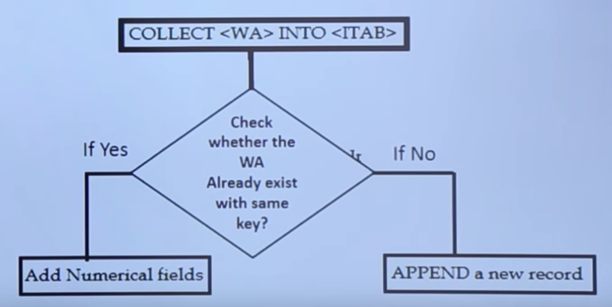

Internal Tables
===========

[Home](../Index.md)

[30 SAP ABAP - Internal Tables - YouTube](https://www.youtube.com/watch?v=5qS67Alyw-U&list=PLWPirh4EWFpH4i1J7CxvDabSycl5YbAhG&index=30)

## Виды внутренних таблиц

#### STANDARD
- Default вид
- Можно оперировать через index и key
	- key это значение ключевого поля(?)
	- index это порядковый номер строки(?)
- Можно использовать линейный и бинарный поиск
	- время бинарного поиска Resp.Time = Log(N)
- Можно append и insert записи где угодно
- Можем сортировать данные на основе своих критериев

#### SORTED
- Специальный вид внутренней таблицы, в которой данный автоматически сортируются при вставке новой строки или строк
- Можно оперировать через index и key
- Можно использовать только бинарный поиск, его время то же
- Не можем сортировать таблицу на основе своих критериев, т.к. сортировка уже задана и так

#### HASHAD
- Это специальный вид таблиц, используется для работы с очень большими данными
- Можно оперировать только через key
- Для чтения записей и поиска нужно использовать алгоритм хеширования
- Время ответа, чтения и поиска всегда одно и тоже и не зависит от количества строк
- В реальности этот тип используется только при меж серверном переносе данных, например из ABAP в BI сервер.

## Создание
```
...TYPE [SORTED] TABLE OF...[WITH UNIQUE KEY] ...
- присвоение типа внутренней таблицы на основе существующей таблицы или структуры
```

### На основе таблиц БД
```
DATA <ITABLENAME> TYPE TABLE OF <DB TABLE NAME>
DATA <ITABLENAME> TYPE TABLE OF <USER-TABLE NAME>
DATA <ITABLENAME> TYPE <DB TABLE NAME> OCCURS 0 WITH HEADER LINE.

Report ZEX_PG/
*Data Declaration
DATA: I_ZCUST_TABLE TYPE TABLE OF ZCUST_TABLE.
DATA: WA_ZCUST_TABLE TYPE ZCUST_TABLE.
Select * from ZCUST_TABLE into Table I_ZCUST_TABLE.
Loop At I_ZCUST_TABLE into WA_ZCUST_TABLE.
	Write: /   WA_ZCUST_TABLE-CUSTNO
						WA_ZCUST_TABLE-CNAME
						WA_ZCUST_TABLE-CITY
						WA_ZCUST_TABLE-GENDER
Endloop.
```
### На основе структуры
#### Поля элементарного типа
```
REPORT ZTEST_INTABLE.
*Объявление структуры и задание типа для ее на основе элементарных типов
TYPES:
  BEGIN OF CUSTOMERLINE,
    CUST_ID TYPE C,
    CUST_NAME(20) TYPE C,
  END OF CUSTOMERLINE.

* TYPES IT_TABLE TYPE SORTED TABLE OF CUSTOMERLINE
DATA IT_TABLE TYPE SORTED TABLE OF CUSTOMERLINE
WITH UNIQUE KEY CUST_ID.

WRITE: /'THE IT_TABLE IS AN INRENAL TABLE'.
```
#### Поля типа `ИМЯ_ТАБЛИЦЫ-ИМЯ_ПОЛЯ`
```
REPORT ZTEST_INTABLE.

*Объявление структуры и задание типа для ее
*полей на основе существующих в системе ИМЯ_ТАБЛИЦЫ-ИМЯ_ПОЛЯ:
TYPES: BEGIN OF TY_KNA1,
  KUNNR TYPE KNA1-KUNNR,
  NAME1 TYPE KNA1-NAME1,
  LAND1 TYPE KNA1-LAND1,
  ORT01 TYPE KNA1-ORT01,
END OF TY_KNA1.

DATA: I_KNA1 TYPE TABLE OF TY_KNA1.
DATA: WA_KNA1 TYPE TY_KNA1.

SELECT KUNNR NAME1 LAND1 ORT01
  FROM KNA1 INTO TABLE I_KNA1
  WHERE LAND1 = 'RU'.

*Обход вн таблицы построчно с записью каждой строки
*в структуру и вывод из структуры построчно заданных полей
LOOP AT I_KNA1 INTO WA_KNA1.
  WRITE:/
  WA_KNA1-NAME1,
  WA_KNA1-LAND1,
  WA_KNA1-ORT01.
ENDLOOP.
```


## Операции

### Примечания к примерам
- **WORKAREA**(WA) - это имеется в виду переменная типа структуры одной строки таблицы, т.е. это по сути одна строка
- **INDEX** - это порядковый номер строки во вн таблице
- **KEY** - это значение ключевого поля вн таблицы

### APPEND
Добавление строки в конец внутренней таблицы из WORKAREA (WA)

```
	DATA: I_ZCUST_TABLE TYPE TABLE OF ZCUST_TABLE.
	*WORKAREA (WA) пример
	DATA: WA_ZCUST_TABLE TYPE ZCUST_TABLE.
```

Пример вставки одной строки из WA:
`APPEND <WA> TO <ITAB>.`

### INSERT
Вставка записи из WA в заданное место временной таблицы по индексу (номеру записи/строки) - месту куда нужно вставить. Если с таким INDEX уже есть строка во вн таблице, то она сместиться вниз (index+1), а вставляемая строка займет ее место. Если index = последней строке +1, то новая строка вставиться в конец таблицы. После вставки нумерация строк вн таблицы измениться/сместится.

Index начинается с 1, при задании 0 будет ERROR!

```
INSERT <WA> INTO <ITAB> INDEX <INDEX NO>.
```

### SORT
Сортировка внутренней таблицы, ASCENDING is default

```
SORT <ITAB> [BY F1 [<ASCENDING/DESCENDING>] F2 [<ASCENDING/DESCENDING>] ...].

*SORT I_KNA1.
*SORT I_KNA1 DESCENDING.
*SORT I_KNA1 BY NAME1 DESCENDING.
*SORT I_KNA1 BY KUNNR DESCENDING NAME1 ASCENDING.
```

### DESCRIBE TABLE
Подсчет количества записей во внтренней таблице

```
DESCRIBE TABLE <ITAB> LINES <VARIABLE>.
```

### READ TABLE WITH INDEX/KEY
Чтение одной записи временной таблицы в WORKAREA (структуру) по индексу или по ключу.

```
READ TABLE <ITAB> INTO <WA> INDEX/WITH KEY <INDEX NO/KEY=VALUE>.

READ TABLE I_KNA1 INTO WA_KNA1 INDEX 3.
READ TABLE I_KNA1 INTO WA_KNA1 WITH KEY KUNNR = 'AAA'.
```

### MODIFY
Изменение/перезапись одного или нескольких заданных полей в строках, выбранных по условию из вн таблицы, данными из соответствующих полей WORKAREA (структуры). Перезаписаны будут только указанные поля в выбранных строках.

```
MODIFY <ITAB> FROM <WA> TRANSPORTING F1 [F2} [F3] [Fn]
WHERE F1 = VALUE AND F2 = VALUE
	
MODIFY I_KNA1 FROM WA_KNA1 TRANSPORTING KUNNR NAME1 LAND1 ORT01 
WHERE KUNNR = '1A51'.
```

### DELETE
Удаление одной или нескольких строк из временной таблицы на основе index или условий.
#### По INDEX
```
DELETE <ITAB> INDEX <INDEX NO>
*Удаление одной записи по индексу
*такой индекс/номер строки должен быть, иначе не будет удаления
DELETE I_KNA1 INDEX 3.
```
#### По условию WHERE
```
DELETE <ITAB> WHERE F1=<VALUE>

*Удаление одной записи по ключу (значению уникального ключевого столбца)
*ключ с таким занченим долен быть, иначе не будет удаления.
*Столбец должен быть уникальным ключом таблицы, иначе удалятся все строки с данным значением.
DELETE I_KNA1 WHERE KUNNR = 'AAA'.

*Удаление всех строк по условию.
DELETE I_KNA1 WHERE LAND1 = 'RU'.
```


### DELETE ADJACENT DUPLICATES
Удаление строк с повторяющимися значениями в заданных полях. Нужно указать одно или несколько полей по которым делать сравнение значений или, если не указано ни одного поля то нужно указать ALL FIELDS.

```
DELETE ADJACENT DUPLICATES FROM <ITAB>
		COMPARING [F1 [F2] [F3] || [ALL FIELDS].
		
DELETE ADJACENT DUPLICATES FROM I_KNA1 COMPARING ALL FIELDS.
DELETE ADJACENT DUPLICATES FROM I_KNA1 COMPARING KUNNR.
```

### CLEAR
Очистка данных из WORKAREA (структуры).
```
CLEAR <WA>.

CLEAR WA_KNA1.
```

### REFRESH
Очистка даных из ITAB.
```
REFRESH <ITAB>.

REFRESH I_KNA1.
```

### FREE
Очистка данных из WORKAREA (структуры) или ITAB
```
FREE <WA/ITAB>.

FREE I_KNA1.
FREE WA_KNA1.
```

### APPEND LINES OF
Добавление данных (срок) выбранных по индексу(-сам) из одной ITAB в конец другой ITAB

```
APPEND LINES OF <ITAB1> FROM <INDEX NO1> TO <INDEX NO2>
	TO <ITAB2>.
	
APPEND LINES OF I_KNA1 FROM 2 TO 3 TO I_KNA1_TMP.
```

### INSERT LINES OF
Вставка данных (срок) выбранных по индексу(-сам) из одной ITAB1 в другую ITAB2 по индексу - номеру строки с какой вставлять новые строки, при этом нижележащие строки будут сдвинуты вниз на количество вставляемых строк (логика как в Excel при вставке строк, соответственно номера строк/индексы изменяться после вставки.
```
INSERT LINES OF <ITAB1> FROM <INDEX NO1> TO <INDEX NO2>
	INTO <ITAB2> INDEX <INDEX NO>.
	
INSERT LINES OF I_KNA1_TMP FROM 1 TO 3 INTO I_KNA1 INDEX 2.	
```

### ПРИСВОЕНИЕ ITAB1[] = ITAB2[]
Для копирования всех данных из одной внуреней таблицы в другую.

```
*ITAB2 копируется(присвоится) в ITAB1
ITAB1[] = ITAB2[].

I_KNA1[] = I_KNA1_TMP[].
```

### COLLECT
Выполнит проверка существования такой WORKAREA(структуры как строки)  в вн таблице, и если точно такой же, с такими же значениями во всех полях, строки нет во вн таблице то будет выполнена вставка новой строки в конец вн таблицы. Если такая строка уже есть во вн таблице, то вставка строки не произойдет. Удобно использовать вместо APPEND, что бы не задублировать строки во вн таблицы.

```
COLLECT <WA> INTO <ITAB>.

COLLECT WA_KNA1 INTO I_KNA1.
```



## Примеры

```
REPORT ZTEST_INTABLE.

*DATA <ITABLENAME> TYPE TABLE OF <DB TABLE NAME>
*DATA <ITABLENAME> TYPE TABLE OF <USER-TABLE NAME>
*DATA <ITABLENAME> TYPE TABLE OF <DB TABLE NAME> OCCURS 0 WITH HEADER LINE.

*& ПРИМЕР1 - создание вн таблицы из структуры
*TYPES:
*  BEGIN OF CUSTOMERLINE,
*    CUST_ID TYPE C,
*    CUST_NAME(20) TYPE C,
*  END OF CUSTOMERLINE.
*
** TYPES IT_TABLE TYPE SORTED TABLE OF CUSTOMERLINE
*DATA IT_TABLE TYPE SORTED TABLE OF CUSTOMERLINE
*WITH UNIQUE KEY CUST_ID.
*
*WRITE: /'THE IT_TABLE IS AN INTERNAL TABLE'.

*& ПРИМЕР2 - создание вн таблицы на основе KNA1, заполнение и обход циклом
*TYPES: BEGIN OF TY_KNA1,
*  KUNNR TYPE KNA1-KUNNR,
*  NAME1 TYPE KNA1-NAME1,
*  LAND1 TYPE KNA1-LAND1,
*  ORT01 TYPE KNA1-ORT01,
*END OF TY_KNA1.
*
*DATA: I_KNA1 TYPE TABLE OF TY_KNA1.
*DATA: WA_KNA1 TYPE TY_KNA1.
*
*SELECT KUNNR NAME1 LAND1 ORT01
*  FROM KNA1 INTO TABLE I_KNA1
*  WHERE LAND1 = 'RU'.
*
*LOOP AT I_KNA1 INTO WA_KNA1.
*  WRITE:/
*  WA_KNA1-KUNNR,
*  WA_KNA1-NAME1,
*  WA_KNA1-LAND1,
*  WA_KNA1-ORT01.
*ENDLOOP.


*& ПРИМЕР2 - APPEND строки в вн таблицу
TYPES: BEGIN OF TY_KNA1,
  KUNNR TYPE KNA1-KUNNR,
  NAME1 TYPE KNA1-NAME1,
  LAND1 TYPE KNA1-LAND1,
  ORT01 TYPE KNA1-ORT01,
END OF TY_KNA1.

DATA: I_KNA1 TYPE TABLE OF TY_KNA1.
DATA: WA_KNA1 TYPE TY_KNA1.

DATA lines_no TYPE I.

SELECT KUNNR NAME1 LAND1 ORT01
  FROM KNA1
  INTO TABLE I_KNA1
*UP TO 100 ROWS.
  WHERE LAND1 = 'RU' AND KUNNR = '1A51'.

*NEW ROW
  WA_KNA1-KUNNR = 'AAA'.
  WA_KNA1-NAME1 = 'ZZZ'.
  WA_KNA1-LAND1 = 'RU'.
  WA_KNA1-ORT01 = 'XXX'.

*APPEND ROW
APPEND WA_KNA1 TO I_KNA1.

*INSERT ROW BY INDEX
WA_KNA1-KUNNR = 'AAAA'.
INSERT WA_KNA1 INTO I_KNA1 INDEX 1.

*SORT
*SORT I_KNA1.
*SORT I_KNA1 DESCENDING.
*SORT I_KNA1 BY NAME1 DESCENDING.
SORT I_KNA1 BY KUNNR DESCENDING NAME1 ASCENDING.

*DESCRIBE TABLE
DESCRIBE TABLE I_KNA1 LINES lines_no.
WRITE: / 'Всего строк: ',
        lines_no,
       /.
LOOP AT I_KNA1 INTO WA_KNA1.
  WRITE:/
  WA_KNA1-KUNNR,
  WA_KNA1-NAME1,
  WA_KNA1-LAND1,
  WA_KNA1-ORT01.
ENDLOOP.

*READ TABLE WITH INDEX/KEY
READ TABLE I_KNA1 INTO WA_KNA1 INDEX 3.
WRITE:/, '-- READ TABLE I_KNA1 INTO WA_KNA1 INDEX 3 --', /,
  WA_KNA1-KUNNR,
  WA_KNA1-NAME1,
  WA_KNA1-LAND1,
  WA_KNA1-ORT01.

READ TABLE I_KNA1 INTO WA_KNA1 WITH KEY KUNNR = 'AAA'.
WRITE:/, '-- READ TABLE I_KNA1 INTO WA_KNA1 WITH KEY KUNNR = "AAA" --', /,
  WA_KNA1-KUNNR,
  WA_KNA1-NAME1,
  WA_KNA1-LAND1,
  WA_KNA1-ORT01.


*&*MODIFY
*MODIFY I_KNA1 FROM WA_KNA1 TRANSPORTING KUNNR NAME1 LAND1 ORT01 WHERE KUNNR = '1A51'.
*WRITE:/, /, '-- MODIFY --'.
*LOOP AT I_KNA1 INTO WA_KNA1.
*  WRITE:/
*  WA_KNA1-KUNNR,
*  WA_KNA1-NAME1,
*  WA_KNA1-LAND1,
*  WA_KNA1-ORT01.
*ENDLOOP.

*DELETE
*DELETE I_KNA1 WHERE LAND1 = 'RU'.
*DELETE I_KNA1 WHERE KUNNR = 'AAA'.
*DELETE I_KNA1 INDEX 3.
*WRITE: /, 'DELETE'.
*LOOP AT I_KNA1 INTO WA_KNA1.
*  WRITE:/
*  WA_KNA1-KUNNR,
*  WA_KNA1-NAME1,
*  WA_KNA1-LAND1,
*  WA_KNA1-ORT01.
*ENDLOOP.

*&DELETE ADJACENT DUPLICATES
*DELETE ADJACENT DUPLICATES FROM I_KNA1 COMPARING ALL FIELDS.
*DELETE ADJACENT DUPLICATES FROM I_KNA1 COMPARING KUNNR.
*WRITE:/, /, '-- DELETE ADJACENT DUPLICATES --'.
*LOOP AT I_KNA1 INTO WA_KNA1.
*  WRITE:/
*  WA_KNA1-KUNNR,
*  WA_KNA1-NAME1,
*  WA_KNA1-LAND1,
*  WA_KNA1-ORT01.
*ENDLOOP.

*CLEAR
*CLEAR WA_KNA1.
*WRITE: /, '-- AFTER CLEAR WA-KNA1 --', /,
*  WA_KNA1-KUNNR,
*  WA_KNA1-NAME1,
*  WA_KNA1-LAND1,
*  WA_KNA1-ORT01.

*REFRESH
*REFRESH I_KNA1.
*WRITE: /, 'REFRESH'.
*LOOP AT I_KNA1 INTO WA_KNA1.
*  WRITE:/
*  WA_KNA1-KUNNR,
*  WA_KNA1-NAME1,
*  WA_KNA1-LAND1,
*  WA_KNA1-ORT01.
*ENDLOOP.

*&FREE ITABLE
*FREE I_KNA1.
*WRITE: /, 'FREE'.
*LOOP AT I_KNA1 INTO WA_KNA1.
*  WRITE:/
*  WA_KNA1-KUNNR,
*  WA_KNA1-NAME1,
*  WA_KNA1-LAND1,
*  WA_KNA1-ORT01.
*ENDLOOP.

*&FREE WA
*FREE WA_KNA1.
*WRITE: /, '-- AFTER FREE WA-KNA1 --', /,
*  WA_KNA1-KUNNR,
*  WA_KNA1-NAME1,
*  WA_KNA1-LAND1,
*  WA_KNA1-ORT01.


*&APPEND LINES OF
DATA: I_KNA1_TMP TYPE TABLE OF TY_KNA1.
APPEND LINES OF I_KNA1 FROM 2 TO 3 TO I_KNA1_TMP.
WRITE: /, 'I_KNA1_TMP'.
LOOP AT I_KNA1_TMP INTO WA_KNA1.
  WRITE:/
  WA_KNA1-KUNNR,
  WA_KNA1-NAME1,
  WA_KNA1-LAND1,
  WA_KNA1-ORT01.
ENDLOOP.

*&INSERT LINES OF
*INSERT LINES OF I_KNA1_TMP FROM 1 TO 3 INTO I_KNA1 INDEX 2.
*WRITE: /, 'I_KNA1'.
*LOOP AT I_KNA1 INTO WA_KNA1.
*  WRITE:/
*  WA_KNA1-KUNNR,
*  WA_KNA1-NAME1,
*  WA_KNA1-LAND1,
*  WA_KNA1-ORT01.
*ENDLOOP.


*&MOVE ITAB1[] TO ITAB2[]
I_KNA1[] = I_KNA1_TMP[].
WRITE: /, 'I_KNA1_TMP'.
LOOP AT I_KNA1_TMP INTO WA_KNA1.
  WRITE:/
  WA_KNA1-KUNNR,
  WA_KNA1-NAME1,
  WA_KNA1-LAND1,
  WA_KNA1-ORT01.
ENDLOOP.

WRITE: /, 'I_KNA1'.
LOOP AT I_KNA1 INTO WA_KNA1.
  WRITE:/
  WA_KNA1-KUNNR,
  WA_KNA1-NAME1,
  WA_KNA1-LAND1,
  WA_KNA1-ORT01.
ENDLOOP.

*& COLLECT
*NEW ROW
  WA_KNA1-KUNNR = 'AAA'.
  WA_KNA1-NAME1 = 'ZZZ1'.
  WA_KNA1-LAND1 = 'RU1'.
  WA_KNA1-ORT01 = 'XXX1'.
COLLECT WA_KNA1 INTO I_KNA1.
WRITE: /, 'I_KNA1'.
LOOP AT I_KNA1 INTO WA_KNA1.
  WRITE:/
  WA_KNA1-KUNNR,
  WA_KNA1-NAME1,
  WA_KNA1-LAND1,
  WA_KNA1-ORT01.
ENDLOOP.

```


