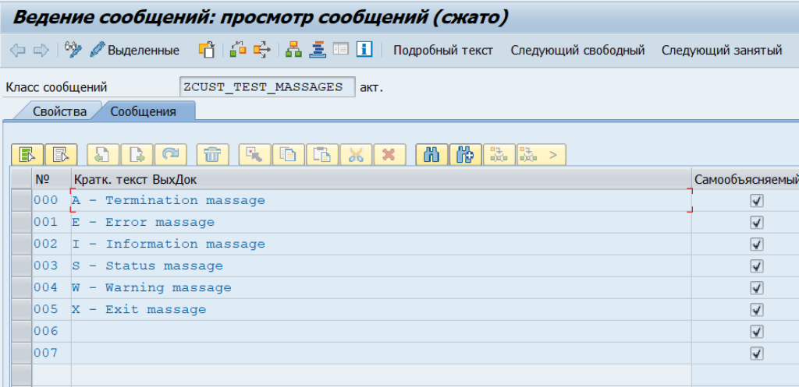
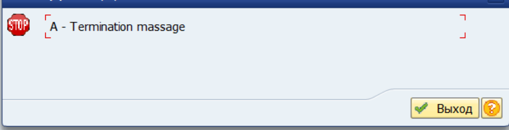
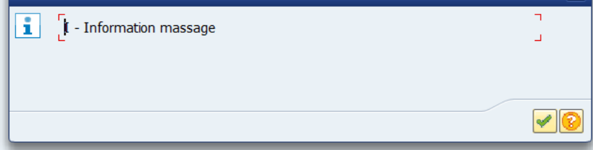
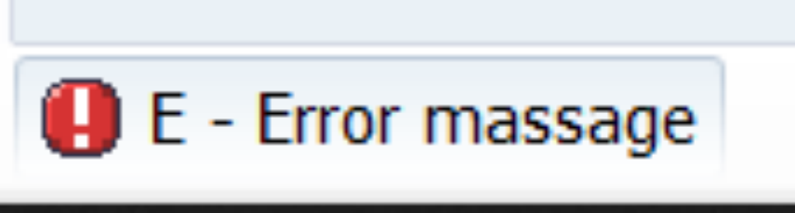
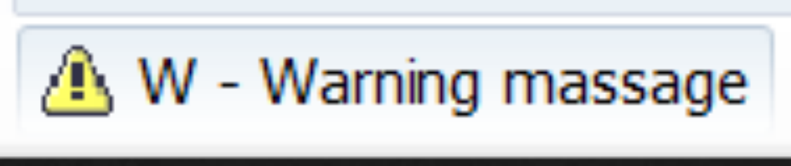
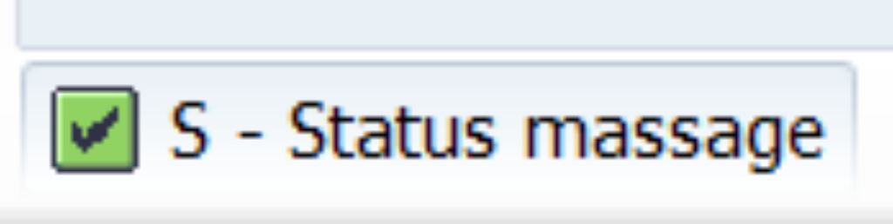
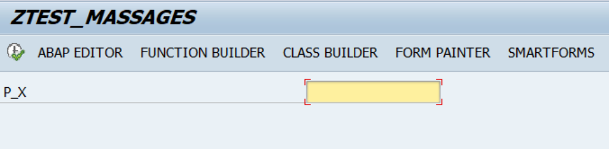

Messages in ABAP
=============

[Home](../Index.md)

[Messages](https://www.youtube.com/watch?v=_VkLdX8Bn4w&list=PLWPirh4EWFpH4i1J7CxvDabSycl5YbAhG&index=40)

Сообщения хранятся в massages class, создать который можно в SE91.

Обычно на каждый ABAP проект используется один massages class.

## SE91

Создание massages class для использования в ABAP программе или проекте. На вкладке Сообщения нужно задать текст для сообщений.




## MASSAGE-ID

 Это ключ-слово (имя massages class в se91) по которому можно massages class присвоить программе (report) и тогда все сообщения из massages class станут доступными для вызова из программы.

```
*Link massages class to report program
REPORT ZTEST_MASSAGES MESSAGE-ID ZCUST_TEST_MASSAGES.
```

## Syntax

### Без предварительного создания massages class

```
*задание напрямую в коде, без предварительного создания massages class
MASSAGE <massage> TYPE '<message type>'.
```

### С предварительным созданием massages class

```
REPORT ZTEST_MASSAGES MESSAGE-ID <massages_class>.

*задание через предварительное создание <massages_class>.
MASSAGE <message_type><massageclass_text_id>.
```


## MASSAGES TYPES


### A - Termination

Прекращение работы программы, появляется как **dialog box**, после подтверждения пользователем возвращает область вышестоящего меню.




### I - Information

Показывается как  **dialog box**, после подтверждения пользователем выполнение программы продолжается со строки кода идущей сразу после блока кода вызова сообщения.




### E - Error

Сообщении об ошибке будет показано в строке состояния и после нажатия enter программа завершиться.




### W - Warning

Будет показано в строке состояния.




### S - Status

Программа продолжает выполнение не останавливаясь на блоке кода сообщения, а само сообщение появляется в строке состояния на следующем экране.




### X - Exit

Сообщений не выводится, а программа завершается с кратким дампом.

#### ST22

Краткий дам можно посмотреть в ST22, где будет указана причина runtime errors.


## Example

Сначала нужно создать massages class ZCUST_TEST_MASSAGES как в пункте SE91,затем его можно использовать в программе. Код примера программы ниже:

```
*Link massages class to report program
REPORT ZTEST_MASSAGES MESSAGE-ID ZCUST_TEST_MASSAGES.

TABLES SSCRFIELDS.
PARAMETERS P_X TYPE I.

SELECTION-SCREEN FUNCTION KEY 1.
SELECTION-SCREEN FUNCTION KEY 2.
SELECTION-SCREEN FUNCTION KEY 3.
SELECTION-SCREEN FUNCTION KEY 4.
SELECTION-SCREEN FUNCTION KEY 5.

INITIALIZATION.

SSCRFIELDS-FUNCTXT_01 = 'ABAP EDITOR'.
SSCRFIELDS-FUNCTXT_02 = 'FUNCTION BUILDER'.
SSCRFIELDS-FUNCTXT_03 = 'CLASS BUILDER'.
SSCRFIELDS-FUNCTXT_04 = 'FORM PAINTER'.
SSCRFIELDS-FUNCTXT_05 = 'SMARTFORMS'.

AT SELECTION-SCREEN.
CASE SY-UCOMM.
  WHEN 'K1'.
    LEAVE PROGRAM.

*X - Exit  
*  WHEN 'FC01'.
*    MESSAGE X005.
*    CALL TRANSACTION 'SE38'.

*A - Termination
  WHEN 'FC01'.
    MESSAGE A000.
    CALL TRANSACTION 'SE38'.

*E - Error
  WHEN 'FC02'.
    MESSAGE E001.
    CALL TRANSACTION 'SE37'.

*I - Information
  WHEN 'FC03'.
    MESSAGE I002.
    CALL TRANSACTION 'SE24'.

*S - Status
  WHEN 'FC04'.
    MESSAGE S003.
    CALL TRANSACTION 'SE71'.

*W - Warning
  WHEN 'FC05'.
    MESSAGE W004.
    CALL TRANSACTION 'SMARTFORMS'.

ENDCASE.
```



Cкрины самих сообщений см в пункте messages types.

