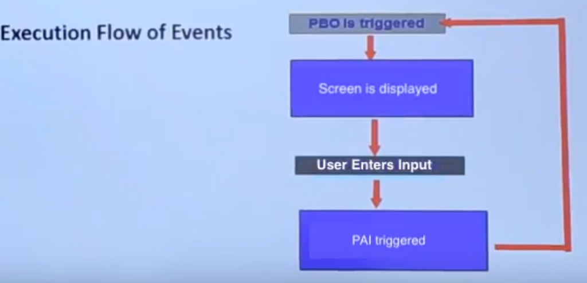
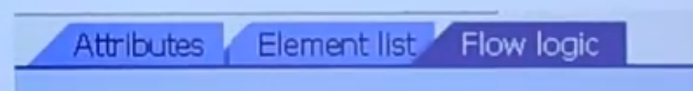
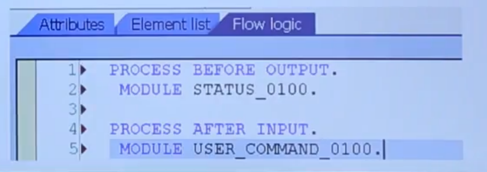

Module Pool Programming
=====================

[Module Pool Programming](https://www.youtube.com/watch?v=1azVD5M1LyQ&list=PLWPirh4EWFpH4i1J7CxvDabSycl5YbAhG&index=66)

Module Pool Programming (MPP) - подход к организации кода приложения и его экранов основанный на разбиении кода программы на модули. Модуль это ABAP подпрограмма для экрана.

MPP - это коллекция экранов, Flow Logic, menu bars и ABAP кода приложеия. В основном это специальный тип программирования для создания САП экранов под бизнес потребности. При запуске пользователем транзакции выполняется вызов modle pool and initial screen number.

MPP - создается в SE80 - ABAP development workbench


## Events in MPP

- PBO (Process Before Output) - вызвается перед показом экрана MPP
- PAI (Process After Input) - вызывается на дисплее MPP после ввода данных пользователем, и так же приводит к вызову PBO события
- POV (Process On Value Requested) - возникает при клике на кнопку поиска в поле ввода или нажатию F4
- POH (Process On Help Request) - возникает при клике на кнопку помощи в поле ввода или нажатию F1



## Modularization in MPP

В основном имеется четыре include programs, которые создаются автоматически в MPP программе:

- <MPP_name>_TOP - top include program. All data declaration
- <MPP_name>_o01 - PBO include program. All logic related to PBO event
- <MPP_name>_i01 - PAI include program. All logic related to PAI event
- <MPP_name>_F01 - Forms include program. All ligic related to subroutines

## Screen

Это разметка экрана которая отражается при output. Состоит из компонентов:

1. Attributes - properties of screen
2. Element List - list of UI/Library elements
3. Flow-Logic - ABAP logic related to MPP
4. Layout - Screen designing Area



## Flow Logic

- Содержит в form или модулях код с логикой, относящейся к экрану
- По умолчанию 2 события будут доступны с их модулями, нужно только раз комментировать вызов модулей и создать их с нужной ABAP логикой

```
PROCESS BEFORE OUTPUT.
*MODULE STATUS_0100.

PROCESS AFTER INPUT.
*MODULE USER_COMMAND_0100.
```




## Module

Это подпрограмма содержащая ABAP код для экрана. Так как Flow Logic не понимает конструкции ABAP (она только может вызвать модуля), то весь код пишется внутри модулей в функциях (form). Именно потому что весь код логики разделен на модуля это и называется - Module Pool Programming


## Steps to Create a Screen

[Steps to Create a Screen](https://www.youtube.com/watch?v=zA_nbjN2ARc&list=PLWPirh4EWFpH4i1J7CxvDabSycl5YbAhG&index=67)


