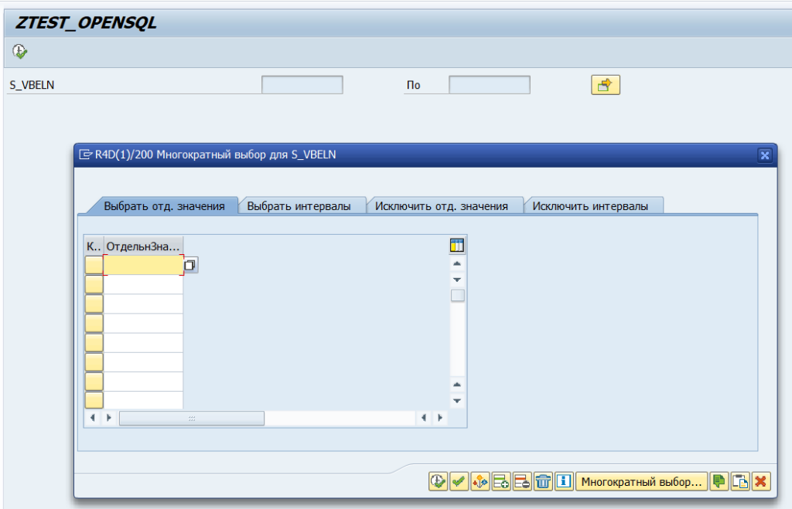
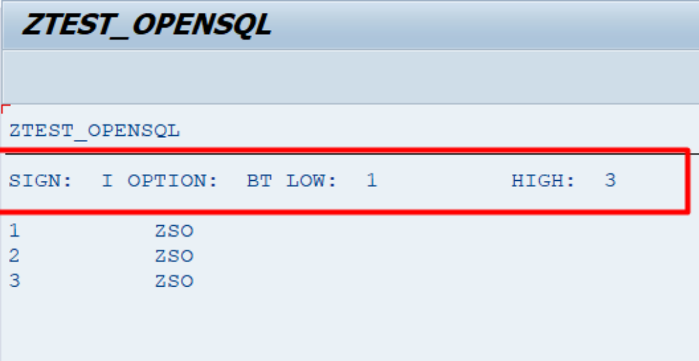
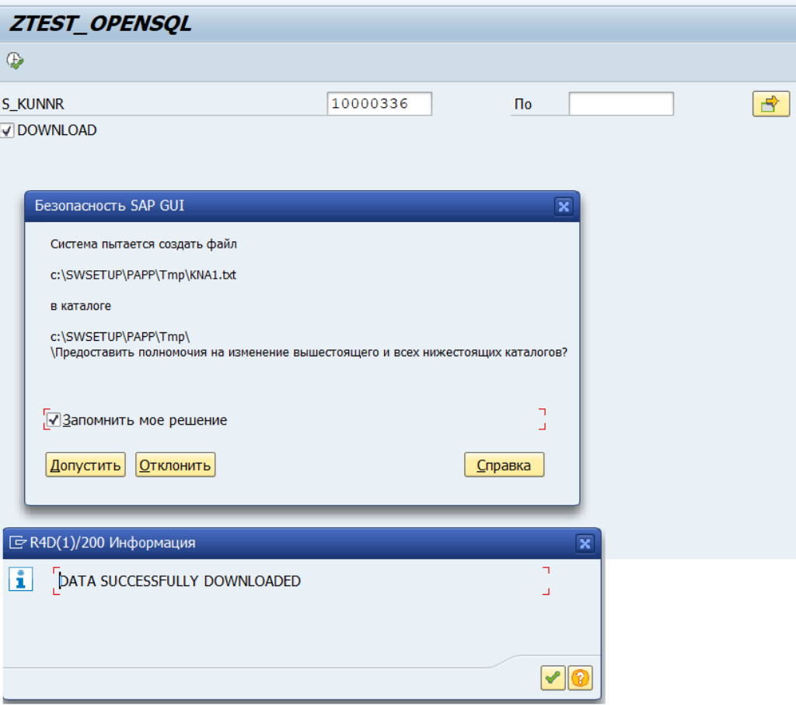

Open SQL
=======

[Home](../Index.md)


[32 SAP ABAP - Open SQL](https://www.youtube.com/watch?v=t0_G9ZQGLXA&list=PLWPirh4EWFpH4i1J7CxvDabSycl5YbAhG&index=32)


## System Variables

Две системные переменные которые обновляются для каждого open sql оператора.

### SY-SUBRC

Хранит код последней open sql операции.

- Если = 0, то open sql операция успешна была
- Если <> 0, то open sql операция failled

### SY-DBCNT
Хранит количество записей успешно обработанных в последней операции open sql.


## Syntax Open SQL

`WA` - это структура равная структуре таблицы DB и содержащая одну строку записи.

`ITAB` - это внутренняя таблица равная по структуре таблице DB.

`WA` и `ITAB` должны иметь туже структуру как и таблица DB.

`TABLENAME-FIELDNAME` - синтаксис записи для обращения к полую таблицы/структур.

`TABLENAMEorALIAS~FIELDNAME` - синтаксис обращения к полям таблицы при `JOIN` запросе.

### Insert

```
INSERT <DB TABLE> FROM <WA>.
INSERT <DB TABLE> FROM TABLE <ITAB>.
```

### Modify

```
MODIFY <DB TABLE> FROM <WA>.
MODIFY <DB TABLE> FROM TABLE <ITAB>.
```

### Update

```
UPDATE <DB TABLE> FROM <WA>.
UPDATE <DB TABLE> FROM TABLE <ITAB>.
```

### Delete

```
DELETE <DB TABLE> FROM <WA>.
DELETE <DB TABLE> FROM TABLE <ITAB>.
```

### Select

`INTO` и `UP TO` операторы можно писать как пред `FROM`, так и после.

```
SELECT  [SINGLE]  <* | F1 F2 F3 ...>
*INTO и UP TO операторы можно писать как пред FROM, так и после
INTO TABLE | [CORRESPONDING FIELDS OF]  <target_area>
[UP TO 100 ROWS]
FROM              <source_dbtable>
[WHERE            <where_condition>]
[GROUP BY         <fields>]
[HAVING           <having_condition>]
[ORDER BY         <fields>].
```
Одну строку можно вставлять в структуру, несколько строк нужно вставлять во вн таблицу.


**Блоки:**
```
INTO и UP TO no ROWS
```
можно писать или перед `WHERE` или после, если `SELECT` выполняется из одной таблицы.


**INTO CORRESPONDING FIELDS OF** - нужно использовать если из таблицы нужно записать в структуру или вн талицу не все поля, а только заданные, при этом тогда можно даже указать `SELECT * ...`, а не строго нужные поля, что бы среда исполнения сопоставила выбираемые поля к соответствующим полям структуры или внутренней таблицы в которые будет выполняться вставка.

#### ПРИМЕРЫ

##### SELECT SINGLE ... INTO CORRESPONDING FIELDS ...

```
DATA LINE TYPE KNA1.
SELECT SINGLE
  KUNNR
  LAND1
  NAME1
  ORT01
  ADRNR
INTO CORRESPONDING FIELDS OF LINE
FROM KNA1
WHERE KUNNR EQ '1A51'.

IF SY-SUBRC EQ 0.
  WRITE: /
  LINE-KUNNR,
  LINE-LAND1,
  LINE-NAME1,
  LINE-ORT01,
  LINE-ADRNR.
ENDIF.

WRITE: /, SY-DBCNT.
```
##### SELECT with JOINS

###### JOIN Syntax

`JOIN` не может быть использован более чем для 3 таблиц в запросе(?), т.к. это сильно нагрузит DB.

- `INNER JOIN`
- `OUTER JOIN` - это `LEFT JOIN`
- знак `~` используют для указания таблицы.имя_поля: **table~field**
- алиасы не строго обязательны, можно пользоваться именами таблиц

```
SELECT ...
INTO ...
[UP TO 100 ROWS]
FROM <DB TABLE1> AS T1
INNER/OUTER JOIN <DB TABLE2> AS T2 ON T1~F1 = T2~F2
...
```


###### SELECT with JOINS EXAMPLE


```
TYPES: BEGIN OF ty_mara_makt,
  matnr TYPE mara-matnr,
  mtart TYPE mara-mtart,
  mbrsh TYPE mara-mbrsh,
  meins TYPE mara-meins,
  spras TYPE makt-spras,
  maktx TYPE makt-maktx,
END OF ty_mara_makt.

DATA i_mara_makt TYPE TABLE OF ty_mara_makt.
DATA wa_mara_makt TYPE ty_mara_makt.

SELECT
  mara~matnr
  mara~mtart
  mara~mbrsh
  mara~meins
  makt~spras
  makt~maktx

INTO TABLE i_mara_makt
UP TO 100 ROWS

FROM mara AS mara

  INNER JOIN makt AS makt ON mara~matnr = makt~matnr
WHERE mara~mtart = 'ZSTD' AND makt~spras = 'RU'.

IF SY-SUBRC EQ 0.

  LOOP AT i_mara_makt INTO wa_mara_makt.
    WRITE: /,
    wa_mara_makt-matnr COLOR 6,
    wa_mara_makt-mtart,
    wa_mara_makt-mbrsh,
    wa_mara_makt-meins,
    wa_mara_makt-spras COLOR 1,
    wa_mara_makt-maktx.
  ENDLOOP.

ELSE.
  WRITE: /, 'Ошибка SQL Запроса'.

ENDIF.
```


##### SELECT FOR ALL ENTRIES IN ITAB

Позволяет выполнить JOIN мужду DB-TABLE ITAB. Такой подход позволяет использовать внутренние таблицы в условия OpenSQL запроса на выборку из DBTABLE, что не нагружает DB  в сравнении с join операциям.

###### Syntax

```
*Сначала извлекаем даные по условию из одной(?) DB table в ITAB1, что бы потом эту выборку из ITAB использовать в другом запросе.
SELECT F1 F2 F3 ...
INTO ITAB1
FROM DBTABLE1
WHERE <conditions>.

IF NOT ITAB1 IS INITIAL.
 SELECT F1 F2 F3 ...
 INTO [CORRESPONDING FIELDS OF] ITAB2
 FROM DBTABLE2
 FOR ALL ENTRIES IN ITAB1
 WHERE F1 = ITAB1-F1 AND F2 = ITAB1-F2.    
ENDIF.
```

###### Example

```
*& SELECT FOR ALL ENTRIES IN ITAB Example
TYPES: BEGIN OF ty_mara,
  matnr TYPE mara-matnr,
  mbrsh TYPE mara-mbrsh,
  meins TYPE mara-meins,
END OF ty_mara.

TYPES: BEGIN OF ty_makt,
  matnr TYPE makt-matnr,
  spras TYPE makt-spras,
  maktx TYPE makt-maktx,
END OF ty_makt.

TYPES: BEGIN OF ty_final,
  matnr TYPE mara-matnr,
  mbrsh TYPE mara-mbrsh,
  meins TYPE mara-meins,
  spras TYPE makt-spras,
  maktx TYPE makt-maktx,
END OF ty_final.

DATA i_mara TYPE TABLE OF ty_mara.
DATA i_makt TYPE TABLE OF ty_makt.
DATA i_final TYPE TABLE OF ty_final.

DATA wa_mara TYPE ty_mara.
DATA wa_makt TYPE ty_makt.
DATA wa_final TYPE ty_final.

* Для вызова экрана выбора и получения значения от пользователя в p_mtart
PARAMETERS p_mtart TYPE mara-mtart DEFAULT 'ZSTD'.

SELECT *
  INTO CORRESPONDING FIELDS OF TABLE i_mara
  UP TO 100 ROWS
  FROM mara
* или здесь тоже можно писать
*  INTO CORRESPONDING FIELDS OF TABLE i_mara
*  UP TO 100 ROWS
  WHERE mtart = p_mtart.

IF NOT i_mara IS INITIAL.
  SELECT *
    INTO CORRESPONDING FIELDS OF TABLE i_makt
    FROM makt
* или здесь тоже можно писать
*    INTO CORRESPONDING FIELDS OF TABLE i_makt
    FOR ALL ENTRIES IN i_mara
    WHERE matnr = i_mara-matnr.
ENDIF.

LOOP AT i_mara INTO wa_mara.
  LOOP At i_makt INTO wa_makt
    WHERE matnr = wa_mara-matnr.

    WRITE: /
    wa_mara-matnr,
    wa_mara-mbrsh,
    wa_mara-meins,
    wa_makt-spras,
    wa_makt-maktx.
  ENDLOOP.
ENDLOOP.
```


### Selection screens

#### Parameters Options of Selection Screens

[Parameter Options](https://www.youtube.com/watch?v=9NGDFx98bvM&list=PLWPirh4EWFpH4i1J7CxvDabSycl5YbAhG&index=34)

Позволяет получить в переменную, объявленную через PARAMETERS только **один** параметр с экрана выбора. Но можно в программе объявить через PARAMETERS несколько разноименных переменных и для каждой будет создано свое поле на экране выбора, но экран выбора будет один, общий для всех таких переменных.

Переменная (например: <P_NAME>) объявленная через PARAMETERS <P_NAME> принимает только одно значение с экрана выбора.

**PARAMETERS** может создавать поле одного из видов:
- input fields
- check-boxes
- Radio Buttons

##### Syntax

```
*P_NAME переменная в которую будет помешен результата выбора пользователя на селекционном экране.

*поле с выбором
PARAMETERS <P_NAME> TYPE <TABLE-FIELDNAME> [DEFAULT 'input_value'].

*чекбокс
PARAMETERS <P_NAME> AS CHECKBOX.

*группа радиопереключателей
PARAMETERS <P_NAME>  RADIOBUTTONGROUP <GROUP NAME>
           <P_NAME2> RADIOBUTTONGROUP <GROUP NAME>
           <P_NAME3> RADIOBUTTONGROUP <GROUP NAME>.
```

##### Example

```
*использование в одной програме для одного экрана выбора несколько переменных вида PARAMETERS.
*& EXAMPLE OF PARAMETERS
DATA WA_KNA1 TYPE KNA1.
PARAMETERS P_KUNNR TYPE KNA1-KUNNR DEFAULT '1A51'.
SELECT SINGLE *
  INTO WA_KNA1
  FROM KNA1
* INTO WA_KNA1
  WHERE KUNNR = P_KUNNR.
WRITE: /
  WA_KNA1-KUNNR,
  WA_KNA1-NAME1,
  WA_KNA1-LAND1.

*AS CHECKBOX
PARAMETERS P_CHECK AS CHECKBOX.
IF P_CHECK = 'X'.
  WRITE:/ 'CheckBox is Selected'.
ELSE.
  WRITE:/ 'CheckBox is not Selected'.
ENDIF.

*еще параметр
PARAMETERS PP_KUNNR TYPE KNA1-KUNNR DEFAULT '1A51'.
SELECT SINGLE *
  INTO WA_KNA1
  FROM KNA1
* INTO WA_KNA1
  WHERE KUNNR = PP_KUNNR.
WRITE: /
  WA_KNA1-KUNNR,
  WA_KNA1-NAME1,
  WA_KNA1-LAND1.
*для всех параметров будет один экран выбора при работе программы
```


#### Select Options of Selection Screens

[Select Options](https://www.youtube.com/watch?v=SXhz8xclvL0&list=PLWPirh4EWFpH4i1J7CxvDabSycl5YbAhG&index=35)

Позволяет пользователю задать диапазон или список значений на экране выбора. Определяет отображение экрана выбора на основе ввода значений из таблицы выбора.

При исполнении `SELECT-OPTIONS <selection_tab_var>` в <selection_tab_var> создается внутренняя таблица (таблица выбора), которая содержит компоненты:

- selection_tab_var-SIGN - знак выбора, например I - интервал
- selection_tab_var-OPTION - тип выбранной опции (например BT - between)
- selection_tab_var-LOW - нижняя граница заданного значения
- selection_tab_var-HIGH - верхняя граница заданного значения

При использовании SELECT-OPTIONS можно настроить layout экрана выбора.

Полученный от пользователя выбор записывается в переменную selection_tab_var, и его можно использовать уже в запросе SELECT ... WHERE <field> IN selection_tab_var.


##### Syntax

```
SELECT-OPTIONS <selection_tab_var> FOR <table-fiend>.
SELECT ... WHERE <field> IN <selection_tab_var>.
```

##### Example 1




```
*& Example of Select Options of Selection Screens
* скрины эранов выбора к этому коду см. выше
TABLES:
  VBAK,
  VBAP.

DATA: int_vbak TYPE VBAK OCCURS 0 WITH HEADER LINE.

SELECT-OPTIONS: s_vbeln FOR VBAK-VBELN.

SELECT *
  INTO int_vbak
  FROM VBAK
  WHERE VBELN IN s_vbeln.

  APPEND int_vbak.
  CLEAR  int_vbak.
ENDSELECT.

*вывод таблицы выбора
LOOP AT s_vbeln.
  WRITE: /
  'SIGN: ',   s_vbeln-sign,
  'OPTION: ', s_vbeln-option,
  'LOW: ',    s_vbeln-low,
  'HIGH: ',   s_vbeln-high.
ENDLOOP.

WRITE: /.

*вывод талицы результата запроса
LOOP AT int_vbak.
  WRITE: /
    int_vbak-vbeln,
    int_vbak-auart.
ENDLOOP.
```


##### Example 2



```
*& Example of Select Options of Selection Screens
* скрины эранов выбора к этому коду см. выше
TABLES KNA1.

SELECT-OPTIONS S_KUNNR FOR KNA1-KUNNR.
PARAMETERS Download AS CHECKBOX.

DATA: I_KNA1 TYPE TABLE OF KNA1.
DATA: WA_KNA1 TYPE KNA1.

SELECT *
  INTO TABLE I_KNA1
  FROM KNA1
  WHERE KUNNR IN S_KUNNR.

IF Download = 'X'.
  CALL FUNCTION 'GUI_DOWNLOAD'
    EXPORTING
      FILENAME = 'c:\swsetup\papp\Tmp\KNA1.txt'
      FILETYPE = 'ASC'
*      WRITE_FIELD_SEPARATOR = 'X' -- это не срабатывает, по умочанию пробел
    TABLES
      DATA_TAB = I_KNA1.

  IF SY-SUBRC = 0.
    MESSAGE 'DATA SUCCESSFULLY DOWNLOADED' TYPE 'I'.
  ENDIF.
ENDIF.
```


